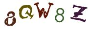
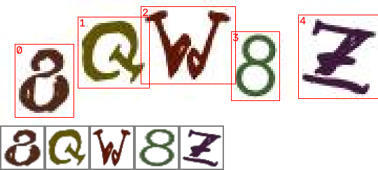
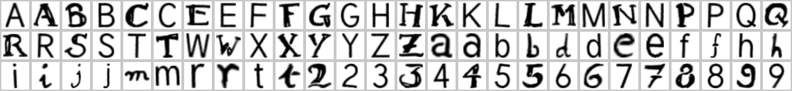

# Captcha solver: template matching + browser autofill

A lightweight recognizer for the 5-character image captcha in a CTF challenge on `abc.in`, plus a
browser extension and a bookmarklet that read the captcha on the page and type the answer into
the captcha box. There's no neural network: each character is matched against learned templates.

<p>
  
  &nbsp;→&nbsp; <b><code>8QW8Z</code></b>
</p>

**Results**

| test | result |
|---|---|
| live captchas checked by hand after training | **50 / 50** fully correct |
| all 580 collected renderings (Python and browser code) | 579 / 580 fully correct |
| speed | ~50 ms per captcha in the browser |

> The extension and the bookmarklet only run on the one host set in `config/config.yaml`
> (`api.host`, exact match, no subdomains). On any other site they do nothing.

---

## How it works

The captcha has 5 characters. Each character is drawn in its own colour, rotated up to about ±45°,
and uses one of two base shapes (fonts). For a given `captcha_id` the answer never changes, only
how it's drawn. That makes a template matcher enough:

```
captcha image
  → segment      each glyph is one blob of one colour: connected components, merge blobs with
                 similar colour (i/j dots), split the widest blob by colour if two glyphs touch
  → normalise    ink = colour distance from the background (so colour doesn't matter), Otsu mask,
                 tight bounding box, pad to a square, resize to 40×40
  → match        normalised cross-correlation against every template rotated -53°…+53° in 2° steps
  → text         best template's character, left to right
```



The templates are learned from labelled data, not drawn by hand. For every character,
`build_templates.py` aligns all training crops by rotation, clusters them into the 2 base shapes
(accepted only if the split is clear, otherwise reported), and averages each cluster upright:



This captcha only uses 39 characters: `0 1 D I J O U V c g k l n o p q s u v w x y z` never
appear, which is typical for generators that drop look-alikes.

## Repository layout

```
config/config.yaml        host, URL pattern, request headers, all tuning parameters
src/
  collect.py              step 1: show captcha → confirm/correct the prediction → save 20 renderings
  segment.py              step 2: cut every image into 5 character crops
  split.py                step 3: train/val/test split by captcha_id (never by image)
  build_templates.py      step 4: learn the 2 base shapes per character
  export_extension.py     step 5: build extension/ + dist/ (zip and bookmarklet)
  predict.py              recognise image files from the command line
  preprocess.py, matcher.py, common.py     shared code
templates/                trained templates (templates.npz) + report.md
extension/                browser extension (recognizer.js is a JS port of the Python pipeline)
dist/                     captcha-extension.zip, bookmarklet.html, bookmarklet.txt
```

## Quick start (just use it)

### Option A: bookmarklet (any Chromium browser, nothing to install)

1. Open `dist/bookmarklet.html` in Chrome or Edge.
2. Drag the **Captcha autofill** button onto your bookmarks bar. (Show the bar with
   <kbd>Ctrl</kbd>+<kbd>Shift</kbd>+<kbd>B</kbd>.)
3. Open the login page on `abc.in` and click the bookmark. The captcha box gets filled in.
   After that it also follows captcha refreshes by itself while the page stays open.

You can also create a bookmark by hand and paste the contents of `dist/bookmarklet.txt` as its URL.
On any other site the bookmarklet only shows *"This bookmarklet only works on abc.in"*.

### Option B: extension (Chrome / Edge, fills in automatically)

1. Unzip `dist/captcha-extension.zip` into a folder.
2. Open `chrome://extensions` or `edge://extensions` and turn on **Developer mode**.
3. Click **Load unpacked** and choose that folder.
4. Open the login page on `abc.in`. The captcha box is filled in as soon as the image loads.

Neither option submits the form; you still press login yourself. If nothing happens, open DevTools
(<kbd>F12</kbd>) and look for `[captcha]` lines in the Console.

## Train it yourself

```bash
pip install -r requirements.txt
```

Set your host in `config/config.yaml`. It's the only line you normally change:

```yaml
api:
  host: abc.in
```

**1. Collect labelled captchas**

```bash
python src/collect.py --start 1559187
```

A small window shows each captcha, and the ids go up by one (`1559187`, `1559188`, …).

| you type | meaning |
|---|---|
| <kbd>Enter</kbd> | the prediction is correct (it's only logged, no images saved) |
| `A7kP2` | the correct answer; 20 renderings of this id are saved with this label |
| `s` | skip this id |
| `r` | show a different rendering |
| `q` | quit (it resumes from here next time) |

Before any templates exist there's no prediction, so you type every answer. About 30 ids were
enough here to cover all 39 characters.

**2–4. Train**

```bash
python src/segment.py
python src/split.py
python src/build_templates.py
```

Check `templates/report.md`: every character should say `two_shapes`.

**5. Check and export**

```bash
python src/predict.py data/sample_1790520937.jpg
python src/export_extension.py
```

`predict.py` prints the text, a per-character match score and margin, and the estimated rotation.
`export_extension.py` rebuilds `extension/`, `dist/captcha-extension.zip` and the bookmarklet from
the current templates. Run it after every retrain, then reload the extension or re-drag the
bookmarklet.

Keep going with `collect.py`: once templates exist it shows its prediction, so you only type the
ones it gets wrong, and those are exactly the examples worth retraining on.

## Notes

- **Host lock.** The manifest only matches `https://<host>/*` and `http://<host>/*`. `content.js`
  checks `location.hostname` again, and only reads images from that host whose path contains
  `/image-captcha-generate/`. The bookmarklet has the same check. The extension requests no
  browser permissions.
- **Model size.** `model.json` holds only the 78 upright templates (125 KB). The browser builds the
  4,212 rotated versions when it loads (about 1.5 s the first time on each page), which keeps the
  zip at 70 KB and lets the bookmarklet carry the whole model inside itself.
- **Same results as Python.** `recognizer.js` reproduces OpenCV's Otsu threshold, area/linear
  resize, Gaussian blur and fixed-point `warpAffine`. On all 580 collected images it gives
  exactly the same answers as the Python pipeline.
- **Other matchers.** `matcher.py` also has chamfer distance, Hu moments, a deskew-then-NCC
  variant and an ensemble. Try them with `python src/predict.py  --method chamfer`.
  NCC with a rotation search is the default, and it's the one the results above were measured
  with. The others weren't benchmarked, and the browser version only implements NCC.
